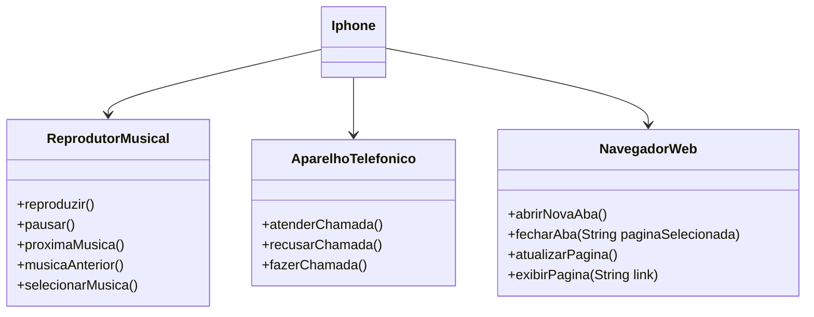

## Diagrama de Classes

```mermaid

classDiagram
    Iphone --> ReprodutorMusical
    Iphone --> AparelhoTelefonico
    Iphone --> NavegadorWeb

    class ReprodutorMusical{
      +reproduzir()
      +pausar()
      +proximaMusica()
      +musicaAnterior()
      +selecionarMusica()
    }
    class AparelhoTelefonico{
      +atenderChamada()
      +recusarChamada()
      +fazerChamada()
    }
    class NavegadorWeb{
      +abrirNovaAba()
      +fecharAba(String paginaSelecionada)
      +atualizarPagina()
      +exibirPagina(String link)
    }

```